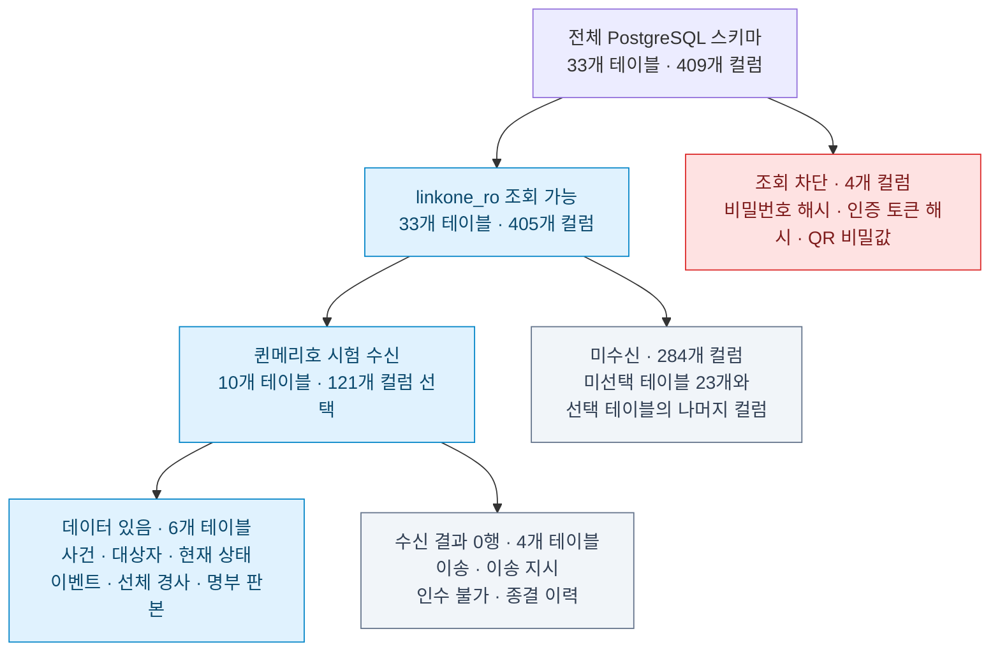
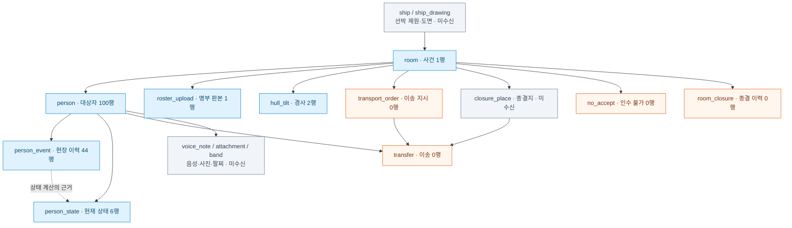

# 링크온 전체 스키마와 해온 조회 범위 비교

2026-09-28 · 전체 구조는 제공 스키마, 현재 권한은 실제 PostgreSQL 메타데이터, 수신 현황은 퀸메리호 스냅샷 기준이다. 숫자는 이번 확인 시점의 값이며 데이터 조회 권한과 외부 반출/모델 전송 권한을 동일시하지 않는다.

## 1. 권한과 수신 범위

405개 컬럼은 has_column_privilege로 SELECT 권한을 확인했다. 전체 컬럼의 실제 값을 모두 읽은 것은 아니다. 차단된 컬럼은 account.password_hash, device_credential.token_hash, auth_session.token_hash, band.secret이다. 해당 4개 테이블도 나머지 허용 컬럼은 조회할 수 있으나 SELECT *는 사용할 수 없다.

## 2. 핵심 업무 관계와 실제 수신 위치

아래는 핵심 관계를 축약한 그림이다. 일반 화살표는 부모에서 이를 참조하는 테이블 방향이며, 점선은 이벤트로 현재 상태를 계산하는 의미다. 색상은 이번 사건에서의 수신 상태를 나타낸다. 전체 33개 테이블의 ERD는 아니다.

ship_drawing은 ship의 하위 자료다. 묶음 노드에서 room으로 이어지는 관계는 ship.id→room.ship_id를 뜻한다. band의 person 관계는 used_person_id이며, 인증 관련 band.secret은 차단된다. account·사용자·인증/근무/참여 세션·장비·감사·반출 관리 등 나머지 영역은 이 핵심 그림에서 생략했다.

## 3. 차이의 의미

- 권한 제한: 비밀 컬럼 4개. 해온은 읽기 전용으로 접속하며 쓰기를 수행하지 않는다.
- 선택 제한: 나머지 미수신 컬럼과 테이블은 이번 시험의 선택 범위다. 전화·주소·생년월일·성별·국적, 음성/사진 원본, 선박 도면 등은 실제 값의 존재 여부를 별도로 확인해야 한다. 도면 반출 제한 등 원문 운용 규칙은 DB 권한과 별도로 유지한다.
- 데이터 부재: 이송 등 4개 표의 0행은 지정 사건·조회 시점의 결과다. 테이블 미구현이나 권한 차단이라는 뜻이 아니다.
- 상태 범위: 대상자 100행 중 현재 상태는 6행뿐이다. 상태 없는 94행을 즉시 미구조자로 채우지 않는다. room.roster_total/expected_count가 null인 것도 0명으로 바꾸지 않는다.
- 이벤트 의미: RESCUE는 7건이지만 현재 상태의 선내/선외 구조는 5/1행이다. UNDO 2건 등이 있어 이벤트 개수를 구조 인원으로 합산하지 않는다. 정확한 차이의 원인은 이벤트 처리 규칙을 확인해야 한다.
- 연결 상태: 수신한 자료는 Git 제외 runtime JSON에 보관했다. 기존 해온 SQLite 장부·세션과 자동 연결된 상태는 아니다.

## 4. 다음 연동 시 우선 확인

1. person_state가 없는 사람의 링크온 기본 상태와 총원 계산 규칙
2. location_place_id를 해석할 closure_place, room.ship_id로 연결된 ship의 필요한 필드
3. 이송·정정·종결/재개가 포함된 시험 데이터
4. 선택 필드 변환 후 해온 수신함/시험 세션에서 원문·출처를 보존하는 경로

이번 권한 확인은 읽기 전용 메타데이터 조회이며 개인별 데이터를 추가로 수신하지 않았다. 점검용 SSH 터널은 종료했다.
