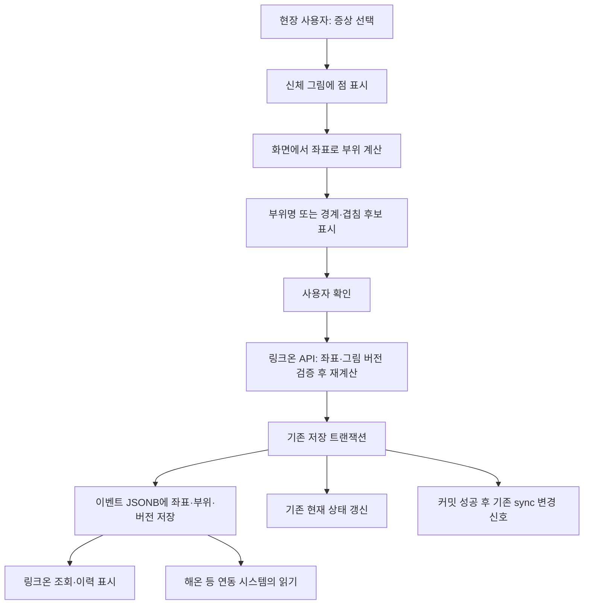

# 링크온 적용 명세 — 점으로 표시한 부상 부위를 계산해 DB에 저장

> 링크온 개발자 전달용 · 2026-09-28 · 계산 알고리즘 `linkone-body-v1`
> 대상: **링크온의 현장 입력 화면·저장 API·DB 이벤트**. 링크온 적용은 개발자가 수행할 제안이며, 해온에서 링크온 DB를 수정한 것은 아니다.

## 1. 목표

현장 사용자가 기존 신체 그림에 점을 찍으면 링크온이 좌표로 부위명을 계산한다. 확인 버튼을 누르면 **증상·원본 좌표·계산한 부위·그림/알고리즘 버전**을 같은 이벤트에 저장한다.

예: `골절`을 선택하고 남성 앞면의 `(x=40%, y=58%)`에 점을 찍으면 **우측 대퇴부 — 골절**로 표시하고 DB에도 `right_thigh / 우측 대퇴부`를 기록한다. 좌표로 골절 여부를 판단하는 것이 아니라, 사용자가 선택한 증상에 위치 설명을 붙인다.

링크온의 기존 이미지 첨부·저장은 유지한다. **해온의 사진 수신 제외, AI 입력량 제한, 최근 이력 표시 개수는 링크온의 저장 정책에 적용할 요구가 아니다.**

## 2. 현장 입력부터 DB 저장까지



화면에서 계산한 값은 미리보기다. **서버가 같은 영역 데이터로 다시 계산한 결과를 DB에 저장**한다. 클라이언트가 보낸 부위명만 믿고 저장하지 않는다. 이미지 인식 AI·외부 API는 필요하지 않다.

## 3. 기존 구조에 붙일 위치

제공된 DB 문서와 공개 화면 코드에서 다음 구조를 확인했다. 서버 저장 코드는 제공받지 않았으므로 실제 변경 지점은 링크온 개발자가 대조해야 한다.

- 입력: `bodyMarkRequest`의 증상 `chip`, 좌표 배열 `points`, 표시 이미지 `image`.
- 이벤트: `person_event.type=CHIP_ON`, `payload.chip`, `payload.body.points`, 선택적인 `payload.body.url`.
- 해제: `CHIP_OFF`. 취소: `UNDO`, `undo_of`.
- 현재 증상: `person_state.chips`. 공개 조회 모델에는 증상별 `bodyMarks`도 있다.

**권장 저장 위치는 기존 JSONB인 `person_event.payload.body`의 확장 필드다.** 한 사람에게 여러 부상 부위가 있으므로 person의 단일 injury 컬럼으로 덮어쓰지 않는다. 이 방식은 새 테이블 없이 적용할 수 있는 제안이다.

JSONB를 유지해도 코드 변경은 필요하다. `chipPayload`/`bodyMarkRequest`의 Zod 정의, 서버 저장 매핑, 이벤트 읽기 검증, `bodyMarks` 조회 모델을 함께 확인한다. 허용 필드에 추가하지 않으면 새 값이 제거되거나 거절될 수 있다. 별도 DB 제약·ORM·트리거가 있으면 그 제약도 확인한다.

## 4. 제안 저장 형식

`coordinateSpace`, `algorithmVersion`, `locations`는 **추가 제안 필드**다. 현재 링크온에 이미 저장되고 있다는 뜻이 아니다. 기존 `points`와 `url`은 유지한다.

```json
{
  "chip": "골절",
  "body": {
    "points": [{"view": 0, "x": 40, "y": 58}],
    "coordinateSpace": "image-percent",
    "algorithmVersion": "linkone-body-v1",
    "locations": [
      {
        "pointIndex": 0,
        "templateId": "male-front",
        "templateSha256": "1dfb80ad79f372710c9abae7a2e509e68404633798df02effcde0116e060da41",
        "status": "mapped",
        "regionCode": "right_thigh",
        "regionLabel": "우측 대퇴부",
        "candidates": [{"code": "right_thigh", "label": "우측 대퇴부"}]
      }
    ]
  }
}
```

- `points`: 원본 좌표. 재계산·감사·화면 복원을 위해 보존한다.
- `pointIndex`: 원본 배열의 몇 번째 점인지 연결한다. 0부터 시작한다.
- `templateId`, `templateSha256`: **점 입력 당시 그림**을 고정한다. 이후 성별 정정이나 그림 교체로 과거 해석이 바뀌지 않게 한다.
- `algorithmVersion`: 판정 영역·규칙 버전.
- `status`: `mapped` / `boundary` / `ambiguous` / `unmapped`.
- `regionCode`, `regionLabel`: mapped일 때만 단일 부위를 저장한다. 그 외에는 모두 null이다.
- `candidates`: 경계·겹침이면 후보 목록을 남긴다. unmapped이면 빈 배열이다.

결과 배열 길이는 점 개수와 같게 한다. 같은 부위에 여러 점을 찍어도 원본은 점별로 보존하고, 화면 요약에서만 같은 코드를 합친다. 경계 후보들을 여러 확정 부상으로 집계하지 않는다.

요청에도 **실제로 보여준 그림 ID·버전**을 추가한다. 여러 그림을 사용했다면 view별 그림 정보를 보낸다. 서버는 허용한 원본 해시와 대조한다. 이전 앱·오프라인 요청의 그림 기준을 알 수 없으면 최신 그림을 임의 대입하지 않고, 원래 좌표를 보존하면서 미계산 사유를 반환하는 호환 처리를 둔다. 위 JSON은 그림 기준을 확인하고 계산까지 완료한 신규 이벤트의 예다.

## 5. 좌표와 판정 알고리즘

좌상단 `(0,0)`, 우하단 `(100,100)`이며 그림 전체 폭·높이의 백분율이다. 기존 화면처럼 여백을 제외한 실제 이미지 표시 영역으로 좌표를 정규화한다.

- 남성 앞면 `male-front`: 235×730, view0.
- 남성 뒷면 `male-back`: 245×711, view1.
- 여성 앞면 `female-front`: 252×714, view0.
- 여성 옆면 `female-side`: 186×697, view1.

좌우는 환자 기준이다. 앞면 화면 왼쪽은 환자 우측이고, 뒷면 화면 왼쪽은 환자 좌측이다. 여성 옆면은 좌우를 확정하지 않는다. 현재 링크온의 성별 미상 처리에서도 실제 선택한 그림 ID를 기록하면 과거 해석을 유지할 수 있다.

그림 4장에 맞춘 다각형 101개를 제공한다. 상복부·하복부·대퇴부·팔다리 등 영역과 점을 비교한다.

1. 입력 검증: 유한한 숫자, x·y=0~100, view=0/1, 최대40점. 신규 저장 API에서는 잘못된 점을 조용히 버리지 않고 입력 오류를 반환하는 것을 권장한다.
2. ray casting으로 각 부위 다각형 내부 여부를 계산한다.
3. 각 다각형 선분까지의 최소 거리를 계산한다.
4. 여러 영역 내부면 ambiguous로 모든 후보를 남긴다.
5. 한 개 이하 영역 내부이며 경계 거리≤0.8이면 boundary로 근접 후보를 남긴다.
6. 단일 영역 내부이며 경계에서 떨어져 있으면 mapped다.
7. 그 밖은 unmapped다. 가장 가까운 부위로 강제 배정하지 않는다.

0.8은 x·y가 각각0~100인 좌표 공간의 거리이며 픽셀·cm 단위가 아니다. 영역은 수작업 근사값이므로 링크온 담당자가 원본 위 미리보기에서 검토한 뒤 채택한다. 장기 손상이나 손상 정도는 판정하지 않는다.

[공통 알고리즘 설명](HAEON_REFERENCE.md#6-계산-알고리즘)에 수식이 있고, [영역 JSON](../../../prototype/knowledge/linkone-body-regions.json)과 [Python 기준 구현](../../../prototype/linkone_body.py)에 실제 값·계산식이 있다. 링크온에서는 이를 브라우저/서버 공통 TypeScript 모듈로 옮길 수 있다. 전달 코드는 Python 참고 구현이며 TypeScript 이식 완료본은 아니다.

Python의 locate 결과를 제안 DB 형식에 옮길 때는 원본 인덱스를 pointIndex로, template을 templateId로 매핑한다. 해당 템플릿의 sha256을 영역 JSON에서 가져온다. mapped인 경우 candidates[0]의 code/label을 regionCode/regionLabel로 쓰고, 나머지는 null로 둔다. Python의 표시용 label에는 경계 안내가 포함될 수 있으므로 이를 확정 부위명으로 저장하지 않는다.

## 6. 서버 저장 순서

아래는 설계 순서이며 실제 링크온 함수명이나 실행 SQL이 아니다.

```text
기존 요청 인증·사건·인물·증상 수정 권한 확인
입력 좌표와 입력 당시 그림 ID/버전 검증
허용한 동일 버전 영역 데이터로 서버에서 부위 재계산
기존 이미지 저장 흐름 수행 → 기존 첨부 URL 유지

기존 이벤트 저장 트랜잭션 안에서:
  기존 중복 요청 방지 기준 확인
  CHIP_ON payload.body에 points + url + locations + 버전 기록
  기존 person_state 및 bodyMarks 관련 상태 계산 경로 갱신
  기존 감사 이력·이벤트 ID 처리 유지
커밋 성공 후 기존 방식으로 sync 변경 신호 갱신

실제 저장된 결과를 화면에 응답
```

점마다 DB 이벤트를 따로 만들 필요는 없다. 기존 확인 버튼의 저장 단위에 점 배열과 결과 배열을 함께 넣는다. 이벤트와 현재 상태를 독립 저장해 일부만 성공하는 구조를 피한다. 이미지 저장 실패 보상·재시도는 기존 정책을 유지한다.

기존 쓰기 성공 경로에 계산 결과를 포함한다. 이벤트 저장 후 별도 SQL로 부위만 수정하면 이력과 변경 신호가 어긋날 수 있다.

## 7. 수정·해제·취소·오프라인

- **위치 수정:** 기존 CHIP_ON 갱신 규칙에 따라 최신 points/locations를 함께 저장한다. 부위만 바꾸고 좌표를 남겨두지 않는다.
- **증상 해제:** CHIP_OFF 때 현재 부위 표시도 해제하되 과거 이벤트는 보존한다.
- **취소:** 기존 UNDO 상태 계산에서 증상과 부위를 함께 복원한다. 해온의 복원 함수를 그대로 복사하기보다 링크온의 기존 계산 경로에 통합한다.
- **점 없는 증상:** 기존 미표시 흐름을 유지하며 부위명을 추정하지 않는다. 점 없는 입력의 요청 형식은 링크온 기존 계약을 따른다.
- **오프라인:** 기존 client_event_id·중복 방지·재전송을 유지한다. 입력 당시 그림 버전과 서버의 차이를 검사하고 미계산 안내를 정한다.
- **경계 확인:** 점을 다시 찍게 하거나 미확인으로 저장할 수 있다. 추후 사용자가 후보를 직접 확정한다면 자동 후보와 사용자 확정값·작성자·시각을 분리한다.

## 8. 과거 데이터와 해온 연동

신규 이벤트부터 확장 형식으로 기록하고, 과거 이벤트에 locations가 없어도 기존 좌표를 읽도록 한다. 첫 적용에서 과거 이력을 대량 UPDATE할 필요는 없다. 필요하면 그림 기준이 확인되는 과거 기록을 조회할 때 계산하고 계산 시점·버전을 구분한다.

**현재 해온은 points를 받아 자체 계산하며, 새 locations 필드를 자동 수신하지 않는다.** 링크온 적용 후 양쪽 필드 계약을 확정해 해온의 수신 허용 필드·검증·표시를 보완해야 한다. 그 단계에서는 링크온의 저장 결과를 출처·버전과 함께 읽고 해온 재계산값과 구분한다.

## 9. 링크온 적용 수용 기준

- 남성 앞면 `(40,58)`을 골절로 저장하면 우측 대퇴부와 원본 점이 같은 이벤트에 저장된다.
- 남성 앞면 `(53,36)`은 상복부, `(53,42)`는 하복부다.
- 남성 뒷면 `(40,60)`은 좌측 대퇴부다.
- 여성 옆면 `(40,34)`은 상복부/상완부 겹침 후보이며 단일 부위 코드는 null이다.
- 그림 밖·잘못된 좌표·다중 점·동일 부위 중복·40점 한도·오프라인 재전송을 검증한다.
- 새로고침해도 서버에 저장된 부위명이 동일하게 보인다.
- 해제·취소·위치 수정 후 현재 표시와 이력이 맞는다.
- 저장 실패 시 이벤트/현재 상태가 일부만 반영되지 않는다. 실패·미리보기는 변경 신호를 갱신하지 않는다.
- 그림 교체·성별 정정 후 과거의 저장 부위명이 자동 변경되지 않는다.
- 새 필드가 없는 기존 이벤트도 조회된다.

## 10. 전달 자료와 검증 범위

- [개발자 전달 ZIP](linkone-body-v1.zip): 이 명세·공통 알고리즘 설명·Python 코드·영역 JSON·도식·미리보기·실행 예제.
- [영역 미리보기](preview.html): 기존 도식 위 영역 확인.
- [해온 구현·검증 참고](HAEON_REFERENCE.md): 해온에서 수행한 단위/HTTP104개, 화면 검증, 실제 시험 좌표 수신 기록.

공통 알고리즘 예제와 전달 파일을 검증했다. **링크온의 저장 API·Zod·상태 계산·DB 적용 및 통합 시험은 아직 수행하지 않았다.** 신규 저장 형식은 링크온 개발자가 적용할 제안이다.
