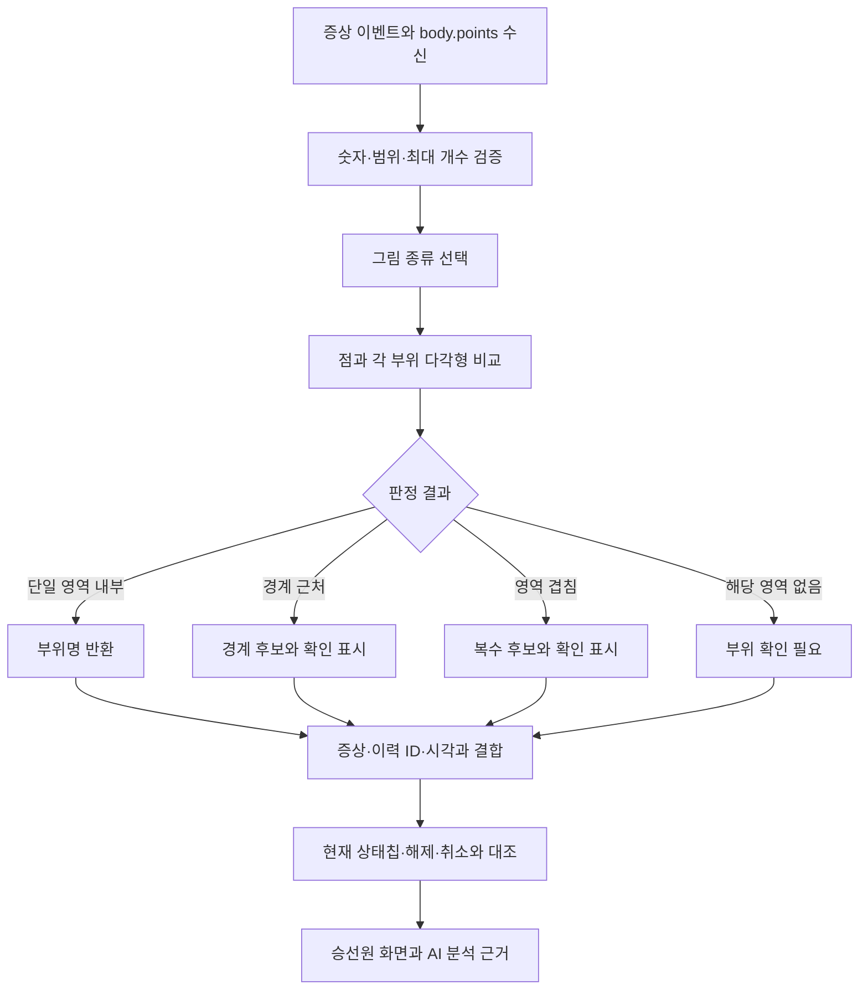

# 링크온 신체 그림 기반 부상 부위 판정

> 해온 구현 및 링크온 개발자 전달용 · 2026-09-28 · 알고리즘 `linkone-body-v1`

## 1. 목적과 구현 범위

링크온에서 구조대원이 신체 그림에 찍은 좌표를 해온이 읽어 `골절 — 우측 대퇴부`, `출혈 — 하복부`, `타박상 — 상복부`처럼 표시한다. 같은 부위명과 기록 근거를 AI 요원에게 전달한다.

기존 그림 4장에 맞춘 다각형 영역 101개와 점 포함 판정을 사용한다. Python 표준 라이브러리만 사용하며 이미지 모델·추가 AI 호출·외부 서버·새 DB 테이블은 필요하지 않다. 그림 파일은 개발자 검토 자료이고 앱의 판정 실행에는 좌표 JSON만 필요하다.

이 결과는 **현장 입력자가 그림에 표시한 부위를 해석한 값**이다. 손상의 진위·정도·내부 장기 손상이나 진단을 계산하지 않는다. 원본 증상명과 계산된 부위, 현재 상태와 과거 기록을 분리한다.

## 2. 전달 파일

- [판정 영역 미리보기](preview.html): 원본 그림 위의 영역을 켜고 끄며 확인. 영역 위에 마우스를 올리면 부위 이름이 나온다. 파일을 브라우저에서 직접 열 수 있다.
- [영역 좌표 JSON](knowledge/linkone-body-regions.json): 실행에 사용하는 단일 기준. 그림별 원본 URL·SHA256·크기·영역 코드·이름·다각형을 포함한다.
- [Python 기준 구현](linkone_body.py): 입력 검증, 좌표 판정, 현재 부상 표시 복원, AI용 요약.
- [독립 실행 예제 검사](verify_examples.py): 주요 부위와 경계·겹침을 확인한다. 해온 전체 시험 코드는 프로젝트 저장소에 별도로 있다.
- `templates/`: 링크온의 기존 공개 도식 4장. 실제 환자의 사진은 포함하지 않는다. 원본 출처는 영역 JSON에 기록했다.

전달할 때 이 MD만 보내면 개념을 검토할 수 있다. 동일한 결과로 구현하려면 **영역 JSON과 기준 구현**도 함께 전달한다. 이 ZIP 안의 링크는 압축 해제한 폴더를 기준으로 한다. 외부 패키지 설치 없이 Python 3.11+에서 실행한다.

## 3. 기존 데이터 계약

현재 원본은 `person_event.type = CHIP_ON / CHIP_OFF`의 `payload.body.points`다. 해온은 `body.url`과 이미지 바이너리를 가져오지 않고 좌표를 수신·저장한다.

```json
{
  "chip": "골절",
  "body": {
    "points": [{"view": 0, "x": 40, "y": 58}]
  }
}
```

- `view`: 정수 0 또는 1.
- `x`, `y`: 그림 전체 폭·높이의 백분율, 각각 0~100. 잘린 인체 영역만의 비율이 아니다.
- 좌상단이 `(0,0)`, 우하단이 `(100,100)`이며 y는 아래로 증가한다.
- 이벤트당 최대 40개 좌표. 해온은 첫 40개 중 유효한 점만 저장한다.
- NaN·무한대·문자열·불리언·범위 밖 값·잘못된 view는 제외한다. 추가 속성·URL·이미지는 저장하지 않는다.
- 점이 없다는 것은 **부위 미표시 또는 미수신**이며 해당 증상이 없다는 뜻은 아니다.

현재 `person_state.chips`에는 증상명만 있으므로 위치는 이력에서 복원하고 현재 상태칩과 대조한다.

## 4. 그림 선택과 좌우

2026-09-28 링크온 화면 코드를 확인한 기준이다.

- `gender=MALE`, `view=0`: 남성 앞면, 235×730.
- `gender=MALE`, `view=1`: 남성 뒷면, 245×711.
- `gender=FEMALE`, `view=0`: 여성 앞면, 252×714.
- `gender=FEMALE`, `view=1`: 여성 옆면, 186×697.
- 현재 링크온은 FEMALE 이외의 값이면 남성 그림을 사용한다. 해온도 같은 그림을 선택하되 `template_basis=linkone_default_male`로 남긴다. 환자의 성별을 남성으로 확정하는 동작은 아니다.

좌우 명칭은 **환자 본인 기준**이다. 앞면에서 화면 왼쪽 다리는 환자의 우측 대퇴부이고, 뒷면에서 화면 왼쪽 다리는 환자의 좌측 대퇴부다. 좌우는 그림의 중앙선을 임의로 가르는 대신 각 다각형의 코드에 명시했다.

여성 옆면에서는 좌우를 확정하지 않고 `대퇴부 (좌우 미확인)`처럼 표시한다. 팔과 복부처럼 그림상 겹치는 영역은 두 후보를 함께 반환한다.

이벤트 이후 성별 정정 기록이 있으면 과거 좌표가 어떤 그림에서 입력됐는지 현재 필드만으로 확정할 수 없다. 해당 좌표는 `template_uncertain`으로 남기고 부위명을 추정하지 않는다.

## 5. 영역 정의

앞면은 머리·안면, 목, 어깨, 흉부, 상복부, 하복부, 골반·서혜부, 상완부, 팔꿈치, 전완부, 손목, 손, 대퇴부, 무릎, 하퇴부, 발목, 발을 구분한다. 팔다리는 좌우가 따로 있다.

뒷면은 후두부, 목 뒤, 등 상부, 허리, 좌우 둔부와 팔다리로 구분한다. 옆면은 측면 흉부·복부·골반과 좌우 미확인 팔다리로 구분한다.

영역은 원본 그림을 보고 수작업으로 정의했다. 정밀 해부학 좌표계나 임상 검증을 완료한 표준은 아니다. 상복부·하복부 경계 역시 해당 그림에서 부위를 설명하기 위한 근사선이며 경계 주변은 확정하지 않는다. 더 세밀한 부위 구분은 양쪽 개발자가 미리보기에서 영역을 검토해 조정할 수 있다.

영역 JSON의 예:

```json
{
  "code": "right_thigh",
  "label": "우측 대퇴부",
  "polygon": [[29.787,40.959],[39.149,43.562],[47.66,50.274],[51.064,51.644],[48.511,63.288],[45.957,65.342],[37.447,66.712],[31.915,64.795],[27.66,57.534],[25.532,50]]
}
```

## 6. 계산 알고리즘



### 점 포함 판정

다각형 꼭짓점을 순서대로 연결한다. 입력 점에서 오른쪽으로 수평선을 그어 변과 만나는 횟수가 홀수이면 내부다(ray casting). 수평 변은 y 비교에서 제외하고, 꼭짓점 중복 계산을 피하기 위해 반열린 구간 비교를 사용한다.

```text
inside = false
각 변 A→B에 대해:
  (Ay > y)와 (By > y)가 다르고
  x < Ax + (Bx-Ax) × (y-Ay)/(By-Ay)이면 inside를 뒤집는다.
```

### 경계 거리

점 P와 선분 A→B에 대해 다음을 계산한다.

```text
t = clamp(dot(P-A, B-A) / dot(B-A, B-A), 0, 1)
Q = A + t × (B-A)
d = distance(P, Q)
```

영역의 모든 변에 대한 최솟값이 경계 거리다. 길이 0인 변은 꼭짓점까지의 거리를 쓴다. 거리 1e-8 미만은 변 위의 점으로 포함한다.

v1의 경계 여유는 **백분율 좌표 공간에서 0.8**이다. x·y 모두 0~100인 공간의 유클리드 거리로 계산하므로 화면 픽셀 기준 원형 반경과는 다르다. 실제 몸의 cm 단위를 뜻하지 않는다.

판정 우선순위:

1. 유효하지 않은 점: `invalid`.
2. 두 개 이상 영역 내부: `ambiguous`, 포함된 모든 영역을 후보로 반환.
3. 한 개 이하 영역 내부이며 어느 경계든 거리 ≤0.8: `boundary`, 내부 영역과 가까운 영역들을 중복 제거해 반환.
4. 단일 영역 내부이며 경계에서 충분히 떨어짐: `mapped`.
5. 나머지: `unmapped`. 가장 가까운 부위로 강제 분류하지 않는다.

분류는 같은 좌표·그림·알고리즘 버전에서 동일한 결과를 낸다. `mapped`도 그림상의 영역 판정이며 임상 확진을 뜻하지 않는다.

## 7. 결과와 예제

입력 `gender=MALE, view=0, x=40, y=58`:

```json
{
  "point": {"view": 0, "x": 40, "y": 58},
  "template": "male-front",
  "template_basis": "recorded_gender",
  "status": "mapped",
  "label": "우측 대퇴부",
  "candidates": [{"code": "right_thigh", "label": "우측 대퇴부"}]
}
```

같은 이벤트의 `chip=골절`과 결합해 **골절 — 우측 대퇴부 표시**로 표현한다. 좌표만으로 골절이나 출혈을 추정하지 않는다.

추가 시험값:

- 남성 앞면 `(53,36)` → 상복부.
- 남성 앞면 `(53,42)` → 하복부.
- 남성 뒷면 `(40,60)` → 좌측 대퇴부.
- 여성 앞면 `(40,58)` → 우측 대퇴부.
- 여성 옆면 `(48,60)` → 대퇴부, 좌우 미확인.
- 여성 옆면 `(40,34)` → 상복부 측면 / 상완부, 겹침 확인.
- 남성 앞면 `(53,39)` → 상복부 / 하복부 경계 확인.
- 남성 앞면 `(2,40)` → 부위 확인 필요.

Python 실행:

```sh
python3 -c 'from linkone_body import locate; print(locate("MALE", {"view":0,"x":40,"y":58}))'
python3 verify_examples.py
```

## 8. 현재 표시와 이력의 구분

1. 동일 인물의 이벤트를 bigint ID의 숫자 순으로 정렬한다. 문자열 사전순으로 정렬하지 않는다.
2. 뒤에서부터 `UNDO.undo_of`를 처리해 취소된 이벤트를 식별한다. `payload.eventId`는 보조 참조로 쓴다. 취소된 UNDO는 적용하지 않는다.
3. 유효한 `CHIP_ON`은 해당 증상의 위치를 교체하고, `CHIP_OFF`는 위치를 해제한다. 새 CHIP_ON에 좌표가 없으면 이전 좌표를 이어받지 않는다.
4. `person_state.chips`에 현재 남아 있는 증상에 대해서만 위치를 현재 표시로 반환한다. 상태 행이 없으면 과거 이력으로 현재 부상을 확정하지 않는다.
5. 과거 부위 이벤트는 최근 8건을 표시하고 취소 여부·이력 ID·서버 시각을 함께 남긴다. 더 오래된 기록은 저장 원본에서 확인한다.

AI에는 현재 부위 표시를 먼저 넣고 최근 이력을 남은 예산 안에서 전달한다. 인물별 최대 1,800자, 전체 부위 정보 최대 8,000자(행 본문 기준)이며 생략 건수를 명시한다. 기존 승선원·현재 상태를 먼저 선택한 뒤 부위 정보를 붙이므로 부위 정보가 길다는 이유로 승선원을 통째로 빼지 않는다. 같은 라벨의 여러 점은 AI 입력에서만 합치고 저장 원본 좌표는 유지한다.

현재 상태칩과 부위 이력을 조합한 결과는 해온의 파생 조회 값이다. 원본 DB나 저장 수신본의 해시를 덮어쓰지 않는다.

## 9. 기존 수신본과 적용

과거 해온 필터는 `body`를 제외했으므로 기존 저장본에 없는 좌표는 재분석만으로 복구할 수 없다. **다시 동기화**하면 원본 이벤트에서 좌표를 가져올 수 있다. 원본에도 좌표가 없는 사건은 계속 미표시로 남는다.

수신 형식 버전은 `projection_version=2`다. 이전 버전 수신본과 비교할 때 `projection_upgrade=true`로 알려 과거 이벤트의 좌표 보강을 새 부상 발생으로 설명하지 않도록 한다. 동일한 수신 데이터라면 기존대로 분석을 반복하지 않는다.

화면: **승선원 · 변경 내역 → 승선원 → 부상 부위·이력**. AI 근거: `people[].injuries.current/history`. 현재 부위에 관한 정보가 없다는 것과 부상이 없다는 것을 구별한다.

## 10. 링크온 개발자와 맞출 기준

현재 DB 계약으로 바로 읽을 수 있어 스키마 변경은 필수가 아니다. 장기적으로 다음 항목을 좌표와 함께 저장하면 그림 교체·성별 정정 이후에도 해석을 유지하기 쉽다.

```json
{
  "templateId": "male-front",
  "templateVersion": "기존-그림-버전",
  "coordinateSpace": "image-percent",
  "points": [{"view": 0, "x": 40, "y": 58}]
}
```

위 추가 필드는 **제안**이며 현재 링크온 DB에서 수신하는 필드가 아니다.

- 원본 그림 크기·여백·방향이 바뀌면 영역도 새 버전으로 교정한다. JSON의 SHA256과 기존 그림을 대조한다. 해온이 매 동기화마다 웹 이미지를 재검증하는 것은 아니다.
- 링크온에서 명확한 부위 코드와 환자 기준 좌우를 직접 입력받으면 그 값을 우선하는 후속 계약을 협의할 수 있다.
- 여성 옆면에서 어떤 쪽 면을 그렸는지와 입력 의미가 확정되기 전에는 좌우 미확인을 유지한다.
- 영역 경계와 부위명은 원본 화면 담당자와 검토 후 다듬는다. 버전 변경 시 과거 원본 좌표를 보존한다.
- 해온의 UNDO·CHIP_ON 교체·CHIP_OFF 처리 기준을 링크온의 실제 상태 계산 규칙과 대조한다. 현재 상태칩과 일치하지 않으면 위치를 억지로 이어붙이지 않는다.

## 11. 검증 기록

- 부위 단위 시험 10개 통과. 앞/뒤 좌우, 상/하복부, 옆면 겹침, 경계, 잘못된 입력, 재표시·해제·취소, 성별 정정, 최초 AI 근거, 과거 좌표 보강을 포함한다.
- 전체 단위/HTTP 시험 104개 통과. 최초 샌드박스 실행의 포트 제한 오류 후 허용된 환경에서 재실행했다. 최종 8.187초.
- 브라우저: 원본 그림 위 101개 영역을 확인하고 격리 DEMO 세션에서 `골절 — 우측 대퇴부`, `출혈 — 하복부`, `타박상 — 상복부`와 이력 열람을 확인했다.
- 실제 시험 사건의 좌표 15개 수신 확인. 부위 계산 약 2.72ms(해당 수신본의 단일 측정). 판정 가능 8개, 경계 확인 4개, 영역 밖/미분류 3개. 이 수치는 임상 정확도가 아니다.
- 실제 AI 응답 품질 시험과 링크온 개발자의 영역 검토는 이번에 실시하지 않았다. AI에 전달되는 근거 구조는 단위/HTTP 시험으로 확인했다.
