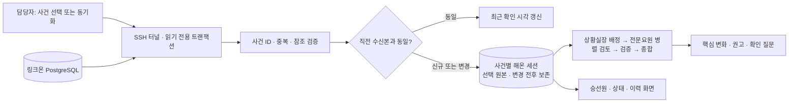

# 링크온 수동 동기화

2026-09-28 구현. 링크온은 다중인명구조 현장 기록·구조본부 공유 프로그램이며, 해온은 수신 자료와 변화에 대한 분석·권고를 제공한다. 이번 경로는 SSH를 통한 **읽기 전용 DB 연동**이다. 기존 승인형 MCP 외부 보고 수신함과 별도로 동작한다.

## 사용

1. 기존 `상황실 실행.command`로 실행하거나 http://127.0.0.1:8860 을 연다.
2. 사이드바 **링크온 동기화**를 누른다. 현재 DB의 사건 목록을 조회하며 실상황·훈련·종결 상태를 구분한다.
3. LIVE/DEMO 분석 방식을 선택하고 사건을 누른다. 사건 UUID마다 전용 해온 세션을 하나 생성한다. 같은 사건을 다시 선택하면 기존 세션의 모드를 선택값으로 설정하고 동기화한다.
4. 최초/변경 수신은 자료 저장 후 **자동 분석**한다. 표별 대기 없이 연속 조회한다. 수신 요청 사이에는 5초 간격을 유지한다. AI 분석 시간은 별도다.
5. **승선원 · 변경 내역**에서 명부 검색, 구조·중증도·위치, 변경 전후, 수신 이력, 표별 선택 원본을 확인한다.
6. **링크온 동기화**를 다시 누르면 새 수신본과 직전 자료를 비교한다. 동일한 자료면 수신본/AI 실행을 추가하지 않는다. **현재 자료 재분석**으로 명시적으로 다시 분석할 수 있다.

해온에서 입력하는 질문·시뮬레이션은 검토 의견이다. 링크온 전용 세션의 원본 집계는 직접 수정하거나 모델 응답으로 변경할 수 없다. 원본 정정은 링크온 담당자가 수행하고 해온에서 다시 수신한다.

## 자료 흐름

## 수신 범위와 의미

- 11개 표: room, person, person_state, person_event, transfer, transport_order, no_accept, hull_tilt, room_closure, roster_upload, closure_place.
- 표별 명시적 열 목록을 사용한다. 승선원의 이름·나이·성별·구분·객실·직책·제외 상태 및 현장 구조·중증도·위치·이송을 포함한다.
- 로그인 비밀, 전화·주소·생년월일의 구조화된 필드, 사진·음성 바이너리는 저장하지 않는다. event payload도 이벤트 종류별 필드를 골라 저장한다. IDENTITY 정정은 이름·나이·성별·구분·객실·직책만 포함한다. 일반 메모·사유에는 원문 작성자가 개인정보를 적었을 수 있으므로 이 방식은 자유문 개인정보 자동 제거 기능이 아니다.
- 저장 원본은 **선택한 필드의 원본**이며 전체 DB 백업이 아니다. 원본을 지우거나 되돌림 이력을 삭제하지 않고 수신 차수별로 보존한다.
- 집계에서 병합·명부 제외·미탑승·제거 대상을 제외한다. 명부 미확보(roster_version=0)는 총원을 미확인으로 유지하고 관찰된 인원 수를 따로 보유한다.
- 상태 미기록자는 링크온 화면 기준 미구조 집계에 포함하지만 위치·중증도는 미확인이다. ‘선내 위치 기록’은 전체 선내 잔류 인원을 의미하지 않는다.
- 퀸메리호 시험 수신: 명부100 / 구조6 / 미구조 집계94 / 상태 미기록94 / 선내 위치 기록5 / 세력 위치 기록1. 시험·시연 데이터다.
- 사건 목록 확인: 실상황 퀸메리호·여객선 한서호, 훈련 낚시어선 충돌. 한서호는 목록 확인까지이며 이번 실 DB 전체 수신 시험은 퀸메리호로 진행했다.

## 저장·일관성·실패

- 기존 SQLite sessions/objects를 사용한다. `linkone_snapshots` 객체에 선택 원본, SHA256, 수신시각, 변경 신호, 집계, 직전 차이를 저장한다. 연결 정보는 session.linkone이다.
- 전체 수신은 REPEATABLE READ / READ ONLY. 표별 키 기반 페이지당 최대1,000행, 수신 작업 사이5초. 한 작업 안의 표·페이지는 연속 조회한다. 표당20,000행/결과20MB/작업240초 상한. 초과나 참조 실패 시 불완전 자료로 기존 자료를 교체하지 않는다.
- `/api/sync`는 수신 전후 토큰을 기록한다. 수동 작업에서는 토큰과 무관하게 전체 기준 상태를 읽으므로 서버 재시작·정정·종결/재개도 새 자료 비교로 반영한다. 자동 폴링은 아직 구현하지 않았다.
- 명부·상태 비교는 인물 UUID, 이력 비교는 원본 ID 기준. 제거는 ‘수신본에서 사라진 행’이며 실제 삭제 원인을 추정하지 않는다.
- 실패 시 마지막 저장 자료 보존. 진행 중 메시지·삭제·중복 동기화 및 AI 진행 중 동기화를 차단한다. 서버 재시작 시 수신은 interrupted, AI는 기존 recover 경로로 중단 표시한다.
- 실행에는 당시 수신본 ID가 남는다. 이후 새 수신본은 이전 분석을 과거 상황 기준으로 표시한다.
- 모델 입력은 현재 승선원 최대150명/40,000자, 표별 변경 종류별20행과 전체14,000자, 보조표30행/각1,800자로 제한하고 생략 수를 알린다. 보조표는 시간과 활성 상태를 우선한다. 큰 자료는 포함 대상·중증도·변경·상태 기록을 우선해 일부를 전달한다. 전체 원본은 상세에서 확인한다. 규모 확장 시 페이지별 AI 검토가 후속 과제다.

## 접속과 실행

`prototype/linkone_source.py`가 기존 `prototype/.secrets/linkone/venv`의 psycopg를 별도 프로세스로 사용한다. 앱 실행 Python에 DB 패키지를 추가할 필요가 없다. 등록된 전용 개인키·DB 비밀번호·고정 known_hosts를 기존 비공개 위치에서 읽는다. 임의 SSH 설정을 무시하고 ED25519 호스트키 확인과 로컬 임시 포트만 사용한다. 자기 터널만 종료한다. 자격증명을 API·문서·로그·커밋에 출력하지 않는다.

- GET `/api/linkone/rooms`: 실제 사건 목록
- POST `/api/linkone/connect`: room_id와 mode로 전용 세션 생성/재사용 및 수신
- POST `/api/sessions/{id}/linkone-sync`: 수동 수신
- POST `/api/sessions/{id}/linkone-analyze`: 현재 자료 재분석
- GET `/api/sessions/{id}/linkone`: 현재 수신 상세
- GET `/api/sessions/{id}/linkone/{snapshot_id}`: 같은 세션의 과거 수신 상세
- GET `/api/sessions/{id}/linkone-history`: 이력 메타데이터

모든 쓰기 경로는 기존 Host/Origin 및 X-Session-Token 검사를 유지한다. 브라우저 폴링은 해온 SQLite 상태만 조회한다.

## 검증 기록

- 최초 전체시험 64개 중 HTTP bind 시험8개는 샌드박스 소켓 권한 때문에 실행 오류. 로컬 서버 실행 권한으로 재시험해 통과했다. 코드 결함과 구분한다.
- 데이터·서비스 시험을 먼저 작성하고 신규 모듈 미구현 실패를 확인한 뒤 구현했다.
- 검토 중 이벤트 내부 개인정보 필드, 미확보 명부 총원, 경사 ID 정렬의 재현시험3개 실패를 확인하고 수정했다. 분석 접수 중단 시 queued 잔류 재현시험도 실패 확인 후 수정했다.
- 실제 DB: 고정 호스트키 SSH, 11개 표157행 수신 및 참조 검증 성공. 원격 쓰기 없음.
- 실제 LIVE: gpt-6-luna/medium, 상황실장 배정1·전문요원3·검증1·종합1 호출 성공. 수신본 ID를 최종 근거로 인용했다. 검증용 DB와 기존 해온 DB의 실행은 구분한다.
- 브라우저: 실시간 목록→전용 세션→수신→자동 LIVE 분석, 명부100명 검색 및 상태 표시 확인. 별도 로컬 가상 자료로 정정1·추가2 및 세 번째 동일 수신 무분석, 과거 수신본 전환 확인. 390px 화면은 페이지 전체 가로 넘침 없고 명부 표 내부 스크롤 사용. 검증 중 브라우저 오류 로그 없음.
- 로컬 가상 자료 시험은 실제 링크온 DB 변경을 의미하지 않는다. 현장 변경을 만들어 시험하지 않았다.

최종 전체 단위/HTTP/MCP 회귀시험 **87개 통과**. JS 구문 검증과 공유 전송 시험 통과. 기존 앱 DB에서도 퀸메리호 수신본1과 LIVE6회 호출 완료, 원본 수신 ID가 최종 보고에 보존됨.

실제 DB 반복 수신 검증(20:18 KST): 변경 없음, 수신 차수1·AI 실행1·완료 호출6 유지. 기본 앱 8860에서 확인, 기존11개 세션 보존. 화면 증거: `prototype/runtime/linkone-evidence/manual-sync-verified.png` (로컬 비공개 runtime).

## 2026-09-28 — 수동 동기화 지연 개선

사용자 요청으로 표·페이지마다 들어 있던 5초 sleep을 제거했다. 한 번의 수신은 순차 연속 조회하며, Source의 작업 직렬화와 수신 작업 사이 5초 간격, 페이지당 1,000행, 읽기 전용 REPEATABLE READ, 크기·시간 한도는 유지한다. 자동 폴링 추가 없음.

실측: 퀸메리호 11개 표157행 직접 수신·검증 **1.14초**, 실행 중인 기본 해온의 HTTP 동기화 완료 **1.06초**. 이전 약57초는 표별 대기55초가 주원인이었다. 같은 자료로 수신본1 유지 및 실행수2→2(중복 분석 없음)를 확인했다. 네트워크·자료 규모에 따라 시간은 달라지고 AI 분석 시간은 별도다. 전체87개 시험 및 linkone.js 구문 검사 통과. 수신은 매번 새 자식 프로세스를 실행하므로 앱 재시작 없이 적용된다. 화면의 기존 ‘1분 이상’ 안내도 수정했다.

## 2026-09-28 — 링크온 필드 해석 근거 보강

기존 요원 입력에는 수신 JSON·집계 주의사항만 있었고 전체 상태 코드 해설은 없었다. `prototype/knowledge/linkone-semantics.md`에 제공된 스키마의 선택 필드 형·관계·설명, enum, 종결 재개/커밋 순서 후속 정정을 정리했다. 링크온 수신본이 있는 세션에만 `linkone_semantics` 공통 근거를 추가한다. 상황실장 배정·전문요원·검증·최종 종합 모두 동일 사전을 받고, 검증 지침에도 구조/이송, 미기록/0, 종결/전원구조, 경사 부호/단위 혼동 점검을 추가했다.

내용: 11개 표 선택 필드, 인물 UUID 관계, 독립 상태 축, 중증도 미분류/사망 코드 없음, 인수 확인과 지시 확인 구분, 표별 to_force 의미 차이, 경사 방향·도 단위·측정 시각, 이벤트 취소, 최초 수신/행수 차이 의미, 생략 범위와 미정의 코드 확인 원칙. 의료 SOP나 미정의 안전 임계값은 만들지 않았다. 원본 수신·DB·집계 변경 없음.

신규 시험은 사전 누락 상태에서 실패를 확인한 뒤 수정했고, 모든 역할/단계 전달 및 일반 세션 미혼입을 검증했다. 실제 LIVE 의미 시험은 자동 승인 검토가 비공개 스키마 해설의 OpenAI API 전송에 대한 별도 승인을 요구하여 차단했으므로 미실행이다. 로컬 전달 시험은 실제 모델의 이해 정확성을 보증하지 않는다.

### 해석 사전 LIVE 검증 완료 — 사용자 승인 후

사용자가 비공개 해설의 OpenAI API 전송에 명시적으로 동의·승인한 뒤 실행했다. 개인정보 없는 10개 질문과 해석 사전만 전달했다. gpt-6-luna / medium, 검증요원 역할 1회 호출 성공. 응답을 사전과 직접 대조해 10개 모두 정의에 부합함을 확인했다: 선내구조≠육상인계, 상태미기록≠선내잔류, ACK≠이송완료, HOLD/ENDED≠사망, 경사 방향·도 단위, 종결≠전원구조, diff행수≠인원수, 표별 to_force 의미, 수신/측정시각 구분, 미등록코드 추정 금지. linkone_semantics를 근거로 인용했고, 모르는 코드는 테이블·필드 정의 확인을 요청했다.

이는 검증요원 역할에서 같은 모델의 의미 해석을 시험한 결과이며 모든 역할의 LIVE 실행이나 모든 현장 판단의 정확성을 보증하지 않는다. 역할별 전달 경로는 앞선 로컬 시험으로 확인했다. 기존 사건의 데이터·분석 보고는 재작성하지 않았다. 원 응답과 평가 기록: prototype/runtime/linkone-evidence/semantics-live-check.json. 앞선 승인 차단·미실행 기록은 당시 경과로 보존한다.

## 2026-09-28 — 링크온 맥락·자원 추천 경량 개선

사용자 제약: 프로그램 규모·상시 작업·의존성을 늘리지 않고 이익이 큰 기존 코드 수정 우선. 새 서비스/패키지/DB표/검색 도구/자동 폴링/추가 모델 호출을 도입하지 않았다.

- 모델 근거에서 person의 중복 room_id·관리 메타데이터·null 등을 빼고 상태를 연결한다. 포함 대상·중증도 기록·변경·상태 기록 순으로 최대150명/40,000자를 선택한다. 전체 삭제 fallback 제거. 최초 수신에는 개인별 본문과 겹치는 added 행 본문을 반복하지 않는다.
- 현재 퀸메리호 검증: 구성 JSON75,818자에서 압축21,496자로 감소, 승선원100명·상태6명 모두 전달, 생략0. 종전에는 70,000자 초과로 전체 개인자료가 빠져 실제 전송은2,468자였으므로 그 불완전 입력 대비 토큰 비용 감소라고 주장하지 않는다.
- 변경자료는 종류별 최대2,000자·전체14,000자, 보조표 각1,800자. 생략행 수를 명시하며 대규모 사건 전체 개인별 검토는 보증하지 않는다. 원본 SQLite 기록은 그대로다.
- 링크온 사건 위치가 명시적으로 동해 지역 목록 범위(묵호/동해시/동해항/울릉/독도)에 해당할 때만 동해 자원 카탈로그를 준다. 제주·위치미상은 고정 동해 추천을 차단한다. 일반 세션의 기존 사용자 제공 동해 목록 동작은 유지한다. 지명 확인은 가벼운 문자열 규칙이며 좌표·관할 GIS 판정이나 실시간 가용성 연동은 아니다.
- 각 단계 모델 응답의 구조화된 출동안도 사건 범위로 제한한다. 관찰된 location_force는 출동 가능 목록이 아니다. 관할 목록이 없으면 필요한 자원 종류·조건을 제시한다. 화면의 세션 자료 목록도 동일 범위로 제한한다.
- 최초/변경/재분석/사용자 질문을 review_purpose로 구분한다. 자동 최초 요청은 과거 자료를 요구하지 않으며 재분석은 새 현장 변화로 표현하지 않는다.
- 기존 최종 종합 호출이 중복 의미 질문을 합쳐0~2개를 선택하도록 한다. 최종 선택을 개별 요원 질문으로 다시 덮어쓰지 않는다. 개별 보고/질문은 tasks·events에 보존한다. 의미 기반 선택은 모델이 수행하며 후처리는 정렬·정확 중복 제거·2개 상한만 수행한다.
- 검증 지침은 ‘정보 없음’을 전달된 people.state와 대조하도록 보강했다. 원본을 추가 조회하는 도구는 이번 범위에 추가하지 않았다.

검증: 신규 결함 재현시험 실패 후 수정. 전체93개 단위/HTTP 시험 통과(최종 재확인 기록 참조), 토큰 갱신·공유 전송 JS시험과 구문 검사 통과. 개인정보 없는 가상 제주 사건의 LIVE6회 호출 완료: 선내 응급4·긴급1/구조세력 응급1 및 상태칩 연결, 동해 출동안 없음, 이전 수신본 요구 없음, 최종질문2개. 가상시험은 실제 퀸메리호 재분석이 아니며 기존 보고를 덮어쓰지 않았다. 결과: prototype/runtime/linkone-evidence/context-live-check.json.

## 2026-09-28 · 링크온 신체 그림 기반 부상 부위 판정

사용자가 기존 그림을 기준으로 우측 대퇴부·상복부·하복부 등을 계산하고 링크온 개발자에게 알고리즘을 MD로 전달하도록 요청했다. 공개 화면의 도식 4장(남성 앞/뒤, 여성 앞/옆)을 확인해 백분율 다각형 101개를 정의했다. `linkone_body.py`와 `knowledge/linkone-body-regions.json`으로 판정한다. 별도 모델·서버·패키지·DB 테이블·추가 AI 호출은 없다.

- CHIP_ON/OFF의 body.points를 이벤트당 최대40개 수신·저장한다. URL·이미지는 제외하고 입력의 숫자·범위를 검증한다. 성별 미상은 링크온의 남성 기본 그림 규칙을 따르되 환자의 성별을 확정하지 않는다.
- 환자 기준 좌우와 상복부·하복부 등을 계산한다. 경계0.8%·겹침은 후보를 반환하고 그림 밖·옆면 좌우·이후 성별 정정에 따른 그림 불확실성은 확정하지 않는다. 수작업 영역이며 임상 검증된 진단 모델이 아니다.
- 현재 상태칩 및 CHIP_ON 교체·CHIP_OFF·UNDO를 대조한다. 현재 부위와 최근8건 이력을 승선원 화면에 표시한다. AI에는 기존 인물 상태를 우선 유지하고 부위 정보 예산(인물별1,800자/전체8,000자 행 본문) 안에서 현재 표시·최근6건 이력을 제공하며 생략 수를 명시한다.
- 원본 수신본을 바꾸지 않고 조회 때 부위를 계산한다. 기존 저장본에서 빠진 좌표는 다음 동기화로 보강한다. projection_version=2 및 projection_upgrade를 통해 과거 좌표 보강을 신규 부상으로 단정하지 않게 한다.
- 전달 문서: docs/handoff/linkone-body/README.md. 수식·Mermaid·예제·그림 기준·이력 처리·템플릿 버전 제안과 원본 위 영역 미리보기를 포함한다.

검증: 신규7개 시험의 미구현 실패 확인 후 구현, 이후10개 부위 단위 시험 통과. 전체 첫 실행은 샌드박스 포트 바인딩 제한으로11개 HTTP/MCP 시험이 실행 오류였다. 허용된 환경에서 전체104개 통과(8.211초), 최종 수정 후104개 재확인 통과(8.187초). JS 구문·기존 토큰 갱신/전송 시험 통과. 격리 DEMO 서버 브라우저에서 골절-우측대퇴부/출혈-하복부/타박상-상복부 및 이력 표시 확인. 이미지4장 SHA256·영역101개·문서 예제·링크 확인.

실제 퀸메리호 읽기 전용 수신:170행, 이벤트56건, body 포함7건/점15개. 수신1.905초, 해당 수신본의 부위 계산2.72ms(단일 측정). 현재 표시점 중 mapped8/boundary4/unmapped3으로 반환했다. 임상 정확도 측정값은 아니다. runtime/linkone-evidence/body-location-receive.json에 별도 보존했다. 실제 세션의 수신본·보고를 이 시험으로 갱신하거나 LIVE 분석하지 않았다.

기존12개 세션이 모두 유휴 상태임을 확인한 뒤8860 서버 재시작, HTTP에서 새 알고리즘/화면 및12개 세션 보존 확인. 기존 상황 삭제는 필요 없다. 화면 새로고침 후 링크온 동기화를 실행하면 좌표를 포함한 새 자료를 받고 기존 설정대로 분석한다. 이번 변경의 LIVE 응답 품질 시험과 링크온 개발자의 영역 검토는 미실시다.

## 2026-09-28 · 링크온 개발자 전달 목적 정정

사용자가 전달 알고리즘은 링크온 자체에서 현장 사용자의 신체 표시 좌표를 부위명으로 계산하고 DB에 저장하기 위한 것임을 명확히 했다. docs/handoff/linkone-body/README.md를 링크온 현장 화면 → 서버 재계산 → 기존 person_event.payload.body JSONB에 좌표·부위코드·그림/알고리즘 버전 저장하는 적용 명세로 개정했다. 기존 해온 구현 설명·검증 기록은 HAEON_REFERENCE.md에 보존했다. Zod·저장 매핑·조회 모델, 트랜잭션/변경 신호, 해제·취소·오프라인·과거 이벤트 호환과 수용 기준을 포함한다. 해온의 사진 제외 정책은 링크온에 적용할 요구가 아님을 명시했다. 링크온의 새 locations 필드는 현재 해온 수신 필터에 자동 포함되지 않으며 계약 확정 후 후속 반영이 필요하다. 문서·전달 ZIP 현행화만 수행하며 해온 앱 기능이나 링크온 DB는 변경하지 않았다.

## 2026-09-28 · 선박 경사 판단 근거 보완

사용자 이미지의 각도표를 IMO·MCA 원문과 대조하고 기존 링크온 분석에 반영했다. 7°/15°는 여객선 손상 후 평형 상태 계산의 기준이며 승선원 생존확률로 설명하지 않는다. 기관 조건의 앞뒤 5°를 사용하지 않고 동적 피칭 7.5°와 중앙값 트림을 구별한다. 진수·기관·비상전원 설계 조건은 적용 범위를 함께 전달한다. 사용자의 권장안 선택에 따라 8분/3°·12분 고정 경보는 설정하지 않았다.

ship_tilt.py가 전체 수신 측정으로 최신 각도·방향·경과시간·절댓값 변화/평균 변화율을 계산하고 linkone_data의 근거에 붙인다. 링크온 모든 분석 단계에 knowledge/ship-tilt-guidance.md를 제공한다. 추가 모델 호출·서비스·패키지·DB 표는 없으며 기존 호출의 근거 분량만 늘었다. 기존 수신본·보고는 보존한다.

검증: 미구현 실패 후 신규 계산/입력 예산/원본 불변 시험 8개, 전체 112개 단위/HTTP/MCP 통과(8.219초). 모든 역할의 근거 전달 확인. 가상 LIVE 수색구조 1회에서 잘못된 생존확률 해석을 정정하고 재측정·침수·대피로 확인을 권고했다. 다만 불확실성 문장에 측정 시각을 ‘수신본’으로 부르는 표현이 남아 모델 문장 정확성까지 보장하지 않는다. 상세 근거·결과·한계: docs/implementation/ship-tilt-guidance.md.

유휴 확인 후 8860 서버 재시작, 기존12개 세션 및 저장 퀸메리호 측정3건의 새 계산을 HTTP로 확인했다. 실제 사건의 새 DB 수신/LIVE 재분석 및 이번 브라우저 시험은 미실시. 화면 새로고침 후 현재 자료 재분석에서 적용되며 최신 DB가 필요하면 동기화를 먼저 한다.

## 2026-09-29 · 接続 운영 문서

[링크온 DB 연결·동기화 통합 절차](../operations/linkone-db-connection.md)에서 새 PC 준비, 키 등록, 수동/앱 터널 차이와 장애 대응을 확인한다. 이번 정리는 문서화이며 원격 접속 재시험이나 앱 기능 변경이 아니다.
